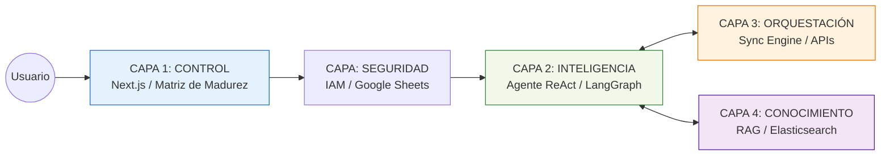
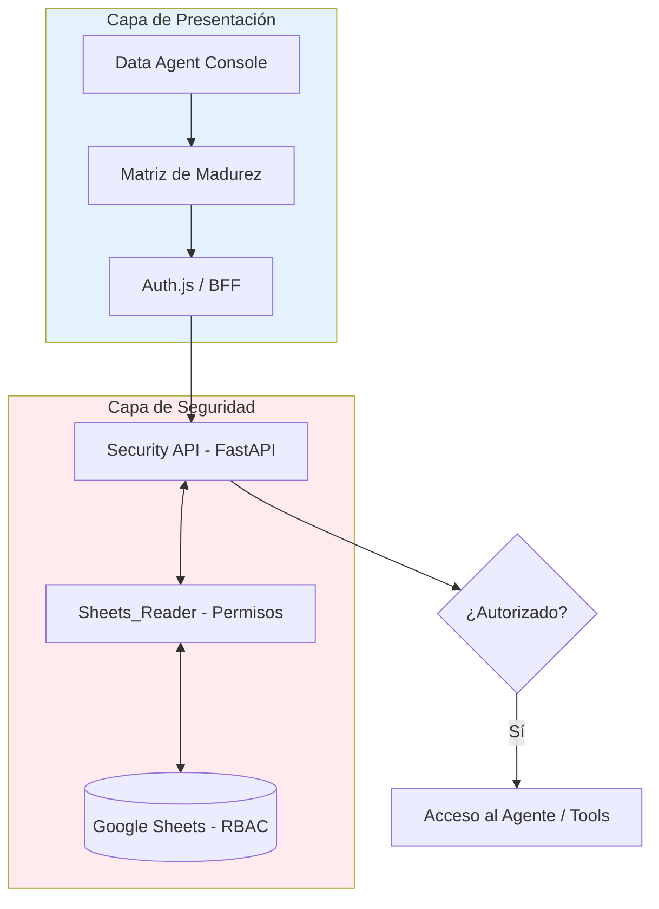
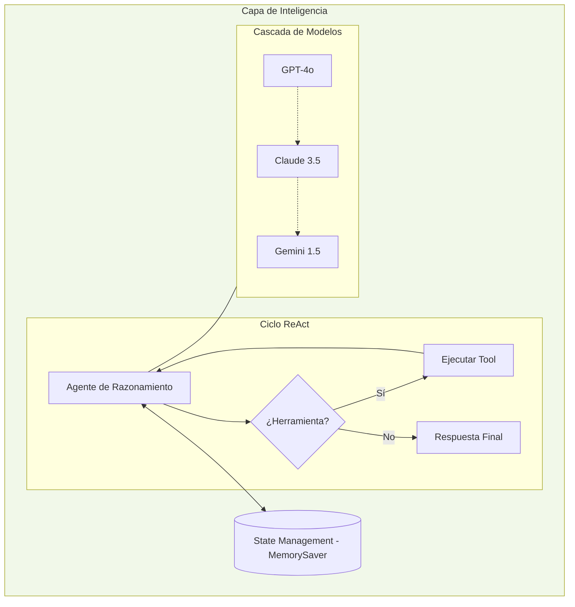
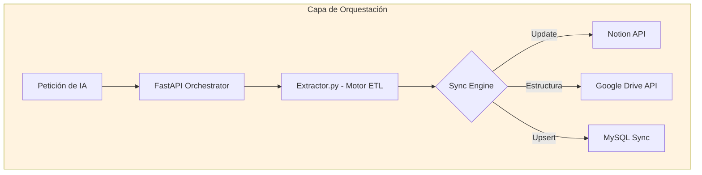
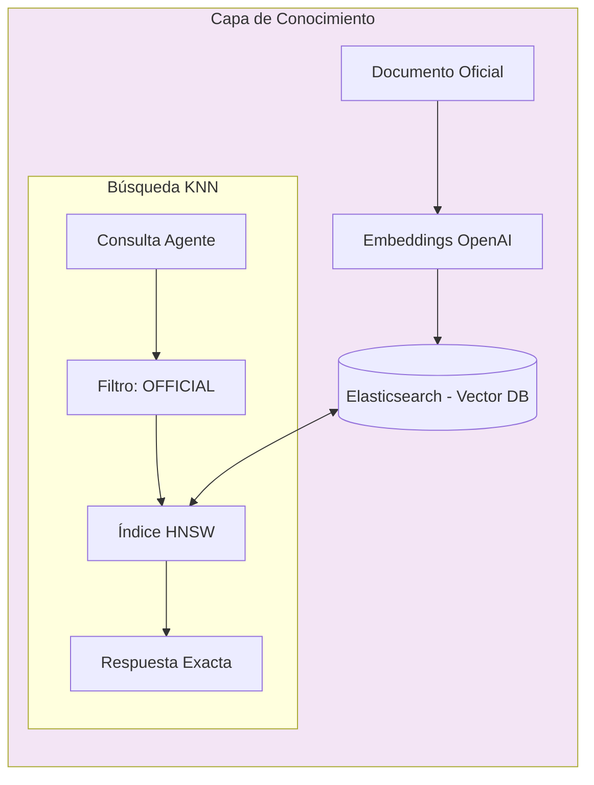

---

# **DOSSIER DE PROYECTO: PORTFOLIO-CORE v1.0**
### *“The Intelligent Knowledge Agent: Arquitectura de Gobernanza y Resiliencia”*

---

## **1. VISIÓN GENERAL: EL CONCEPTO (Nivel No Técnico)**
**Portfolio-CORE** no es simplemente un chatbot; es un **Asistente Ejecutivo de Élite** para la gestión de proyectos. Imagine que su empresa tiene miles de documentos dispersos en Google Drive, tableros en Notion y registros en Excel. Portfolio-CORE actúa como el cerebro central que:
1.  **Valida:** Asegura que solo la información "Oficial" sea consultable.
2.  **Sincroniza:** Mueve los datos entre plataformas automáticamente.
3.  **Responde:** Entiende preguntas complejas y da respuestas precisas en segundos.

### **Diagrama Macro: El Ecosistema Portfolio-CORE**
Este gráfico muestra cómo el usuario interactúa con un sistema blindado y conectado.

---

## **2. CAPA 1 & SEGURIDAD: EL CONTROL HUMANO (Nivel Funcional)**
**Objetivo:** Devolver al usuario el mando sobre los datos.
*   **La Matriz de Madurez:** Es una interfaz donde el usuario marca el ciclo de vida del documento (Borrador -> Revisión -> Oficial). La IA solo "aprende" lo que está en verde (Oficial).
*   **Seguridad Dinámica (IAM):** El acceso se controla mediante un Google Sheet. Esto permite que un administrador gestione permisos sin saber programar.

### **Diagrama de Flujo: El Portero y la Consola**

---

## **3. CAPA 2: EL CEREBRO RESILIENTE (Nivel Técnico)**
**Objetivo:** Razonamiento inteligente y disponibilidad garantizada.
*   **Agente ReAct (LangGraph):** El agente no responde al azar; "piensa" antes de actuar. Si necesita un dato de Notion, llama a la herramienta correspondiente.
*   **Resiliencia Multi-LLM:** Si OpenAI falla, el sistema conmuta automáticamente a **Claude 3.5** o **Gemini 1.5**. El negocio nunca se detiene.
*   **State Management:** El sistema tiene "memoria de estado" (Checkpointing), recordando el hilo de la conversación.

### **Diagrama de Inteligencia: Razonamiento y Fallbacks**

---

## **4. CAPA 3: EL SISTEMA NERVIOSO (Nivel de Integración)**
**Objetivo:** Interoperabilidad total y fin del trabajo manual.
*   **Orquestador Asíncrono:** Un motor que procesa archivos Excel y los "empaca" para enviarlos a MySQL y Notion simultáneamente.
*   **Automatización Drive:** Crea automáticamente una estructura de 4 fases y 5 etapas en la nube para cada nuevo proyecto.

### **Diagrama de Orquestación: Conectividad Multi-Silo**

---

## **5. CAPA 4: LA MEMORIA OFICIAL (Nivel de Ingeniería de Datos)**
**Objetivo:** Verdad certificada y búsqueda semántica ultra-rápida.
*   **RAG (Retrieval Augmented Generation):** La IA consulta documentos PDF/DOCX en tiempo real.
*   **Elasticsearch + HNSW:** Usamos índices de "pequeños mundos navegables" (HNSW). Esto permite encontrar una respuesta entre millones de páginas en milisegundos (**O-logN**).
*   **Filtro de Gobernanza:** Solo se recuperan fragmentos de texto con el sello `OFFICIAL_VALIDATED`.

### **Diagrama de Memoria: El Almacén Vectorial**

---

## **6. RESUMEN TÉCNICO DE VALOR **
1.  **Desacoplamiento:** Microservicios independientes. Si una API externa falla, el sistema sobrevive.
2.  **Anti-Alucinación:** Gobernanza estricta. La IA no inventa; cita fuentes oficiales de la Capa 4.
3.  **Resiliencia:** Arquitectura de fallbacks única en su clase (GPT/Claude/Gemini).
4.  **Eficiencia:** Sincronización automática que ahorra cientos de horas hombre de gestión administrativa.

---
**PORTFOLIO-CORE: Connect. Certify. Chat.**
