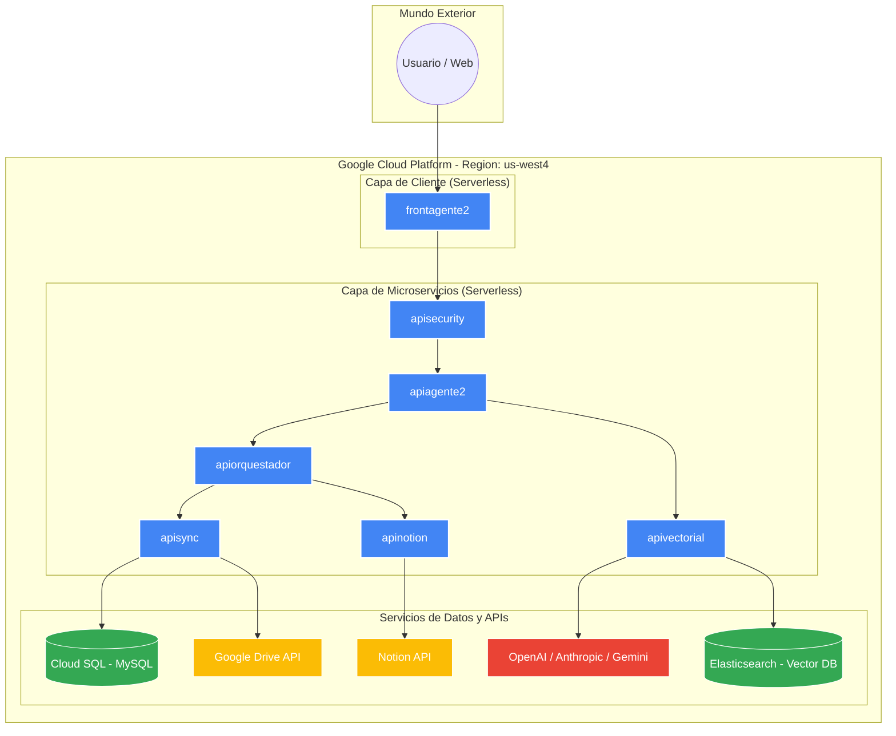

---

# **DOSSIER TÉCNICO: PORTFOLIO-CORE v1.0**
### **"The Intelligent Knowledge Agent: Arquitectura de Gobernanza y Resiliencia"**

**Estado:** Producción (Google Cloud Platform)  
**Región de Despliegue:** us-west4 (Las Vegas)

---

## **1. DESCRIPCIÓN DEL PROYECTO**
**Portfolio-CORE** es un ecosistema avanzado de Inteligencia Artificial Generativa diseñado para la **Gobernanza de Datos y Orquestación de Proyectos**. La plataforma resuelve la fragmentación de información en las empresas mediante un **Agente ReAct** que integra de forma asíncrona Google Drive, Notion y bases de datos relacionales. 

Su principal diferencial es la **Matriz de Madurez Documental**, una interfaz que permite al usuario humano validar el ciclo de vida del conocimiento. Esto garantiza que la IA solo consuma y responda basándose en activos de información **Oficiales y Certificados**, eliminando alucinaciones y asegurando la veracidad corporativa en cada consulta.

---

## **2. STACK TECNOLÓGICO**
La arquitectura se basa en **Microservicios Contenedorizados** y escalables:

*   **Frontend:** Next.js 14+ (App Router), TypeScript, Tailwind CSS, Auth.js.
*   **Inteligencia (AI):** LangGraph (Agentes), OpenAI (GPT-4o), Anthropic (Claude 3.5), Google (Gemini 1.5).
*   **Backend / APIs:** FastAPI & Flask (Python 3.10+), httpx (Asincronía).
*   **Bases de Datos:**
    *   **Vectorial:** Elasticsearch 8.x con índices **HNSW** (Búsqueda Semántica KNN).
    *   **Relacional:** MySQL 8.0 (Gobernanza, Auditoría y Sync Logs).
    *   **No-Code:** Google Sheets API (Gestión de Seguridad IAM).
*   **Infraestructura Cloud:** Google Cloud Run (Serverless), Artifact Registry, Cloud SQL, Google Drive API, Notion API.

---

## **3. ESTRUCTURA DEL CÓDIGO**
El proyecto está desacoplado en microservicios para permitir mantenimiento y escalabilidad independiente:

```text
📂 portfolio-core/
├── 📂 agente-frontend/    # Interfaz Next.js y Matriz de Madurez (BFF Pattern).
├── 📂 agente-backend/     # Cerebro IA (LangGraph, Fallbacks, MemorySaver).
├── 📂 apisync/            # Motor ETL (Extractor Excel, Drive Sync, MySQL).
├── 📂 api-vectorial/      # RAG Service (Elasticsearch, PDF/Docx Indexing).
├── 📂 apisecurity/        # IAM Service (Validación vía Google Sheets).
├── 📂 apinotion/          # Integración bidireccional con Notion API.
└── 📂 apiorquestador/     # Sistema nervioso central de peticiones.
```

---

## **4. GUÍA DE DESPLIEGUE (PASO A PASO)**

### **Fase 1: Configuración de Entorno y Credenciales**
1.  **Variables:** Configurar los archivos `env-*.yaml` con las llaves de API (OpenAI, Anthropic, Gemini, Notion).
2.  **Google Cloud Setup:** Habilitar las APIs de **Cloud Run**, **Artifact Registry** y **Cloud SQL**.
3.  **Identidad:** Crear la **Service Account** en GCP, descargar `service_account.json` y colocarlo en los microservicios de `sync` y `vectorial`.

### **Fase 2: Ejecución Local (Docker Desktop)**
1.  Desde la raíz del proyecto, ejecutar:
    ```bash
    docker-compose up --build -d
    ```
2.  Verificar que los servicios estén arriba en `localhost:3000` (Front) y puertos `8080` (APIs).

### **Fase 3: Despliegue en la Nube (Google Cloud Run)**
1.  **Build:** Subir las imágenes al **Artifact Registry**:
    ```bash
    gcloud builds submit --tag gcr.io/[PROJECT_ID]/apiagente2
    ```
2.  **Deploy:** Implementar contenedores en la región **us-west4**:
    ```bash
    gcloud run deploy apiagente2 --image gcr.io/[PROJECT_ID]/apiagente2 --region us-west4 --allow-unauthenticated
    ```

---

## **5. DIAGRAMA DE DESPLIEGUE: INFRAESTRUCTURA CLOUD**
Este gráfico representa la topología real del proyecto en Google Cloud Platform.



---

## **6. CÓMO PROBAR EL AGENTE (CASOS DE ÉXITO)**

Para validar la operatividad total el **23 de marzo**, siga estos protocolos:

### **Escenario A: Sincronización e Interoperabilidad**
*   **Acción:** Subir un archivo Excel de cronograma de proyecto.
*   **Validación:** El agente debe confirmar la creación de carpetas en **Google Drive** (Fases/Etapas) y la actualización del tablero Kanban en **Notion**.
*   **Valor:** Demuestra la capacidad del **Orquestador** para romper silos de datos.

### **Escenario B: Gobernanza y RAG Certificado**
*   **Acción:** Subir un manual técnico y marcarlo como **"OFFICIAL_VALIDATED"** en la Matriz de Madurez.
*   **Validación:** Preguntar a la IA sobre un detalle técnico de ese manual.
*   **Valor:** Demuestra que la IA solo responde con fuentes oficiales, evitando alucinaciones.

### **Escenario C: Resiliencia (Fallback)**
*   **Acción:** Realizar una consulta compleja. Si se simula una caída de OpenAI, el sistema debe responder con Claude o Gemini.
*   **Valor:** Demuestra la **Alta Disponibilidad** del sistema en entornos productivos.

---

## **7. CONCLUSIÓN TÉCNICA**
**Portfolio-CORE** representa la convergencia perfecta entre la **Inteligencia de Capacidad** (Agentes ReAct) y la **Integridad de Información** (Gobernanza Vectorial). Su arquitectura desacoplada, su resiliencia multi-modelo y su despliegue en la nube lo posicionan como una solución de grado empresarial lista para transformar documentos estáticos en activos de inteligencia estratégica.

**"Portfolio-CORE: Connect. Certify. Chat."**
