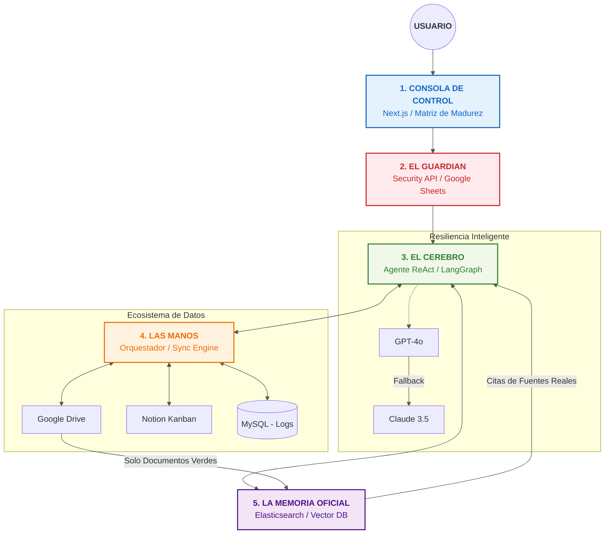

# Portfolio-CORE
Ecosistema de IA Generativa con arquitectura de microservicios que orquesta datos de Drive, Notion y MySQL mediante agentes resilientes y RAG sobre Elasticsearch

---

# **1. INTRODUCCIÓN Y PROPÓSITO DEL PROYECTO**

### **1.1. Contexto Estratégico**
En el actual ecosistema corporativo, las organizaciones enfrentan un desafío crítico: la **fragmentación de activos de información**. Los datos estratégicos residen en silos aislados —unidades de red (Google Drive), plataformas de gestión colaborativa (Notion) y bases de datos relacionales (MySQL)— lo que genera una brecha de conocimiento, duplicidad de tareas y, fundamentalmente, una pérdida de la **trazabilidad oficial**.

La implementación convencional de Inteligencia Artificial a menudo ignora la jerarquía y la veracidad de estos datos, resultando en respuestas imprecisas o "alucinaciones" que no cumplen con los estándares de auditoría y cumplimiento empresarial.

### **1.2. Definición de Portfolio-CORE**
**Portfolio-CORE** surge como una respuesta de ingeniería avanzada diseñada para cerrar la brecha entre la **Inteligencia de Capacidad** (IA Generativa) y la **Integridad de Información** (Gobernanza de Datos). No se define simplemente como un asistente conversacional, sino como un **Agente Orquestador de Conocimiento** capaz de navegar, sincronizar y certificar el flujo de información de un portafolio de proyectos complejo.

### **1.3. La Propuesta de Valor: De la IA al Gobierno de Datos**
El núcleo diferenciador de este sistema es la implementación de una **Matriz de Madurez Documental**. Esta funcionalidad permite al usuario humano supervisar el ciclo de vida del dato, asegurando que la arquitectura de **Recuperación Aumentada (RAG)** solo consuma información que ha alcanzado un nivel de madurez "Oficial". 

Mediante una infraestructura de **microservicios asíncronos y resilientes**, Portfolio-CORE garantiza que la "Verdad Única" de la organización esté siempre disponible, actualizada y, sobre todo, validada por expertos humanos.

### **1.4. Alcance Técnico y Arquitectura**
El presente documento detalla una arquitectura de grado industrial desplegada en la nube (**Google Cloud Run**), que integra:
*   **Agentes Inteligentes (LangGraph):** Con capacidad de razonamiento autónomo y memoria de estado persistente.
*   **Resiliencia Operativa:** Una estrategia multi-modelo con *fallbacks* automáticos para garantizar alta disponibilidad.
*   **Búsqueda Semántica de Alto Rendimiento:** Indexación vectorial mediante algoritmos **HNSW** en Elasticsearch para recuperaciones instantáneas.
*   **Interoperabilidad Total:** Sincronización bidireccional entre ecosistemas Cloud y bases de datos relacionales.

---

# **2. El Gráfico: "El Viaje del Dato Oficial"

1.  **La Consola (El Control):** "Aquí el usuario no solo chatea, sino que **gobierna**. Usa la *Matriz de Madurez* para decir qué archivos son borradores y cuáles son Verdad Oficial."
2.  **El Guardián (La Seguridad):** "Antes de que la IA se mueva, nuestra API de Seguridad revisa una lista en la nube. Si no tienes permiso, el sistema no te muestra ni una palabra."
3.  **El Cerebro (La Inteligencia):** "Usamos un Agente que **razona**. Si le pides algo, él decide si debe ir a buscar en los documentos o actualizar el estado en Notion. Además, es **resiliente**: si falla una IA, usa otra de respaldo automáticamente."
4.  **Las Manos (La Orquestación):** "Este es el motor que hace el trabajo pesado. Conecta Google Drive, Notion y las bases de datos para que todo esté sincronizado en segundos, sin que el humano tenga que copiar y pegar nada."
5.  **La Memoria (La Verdad):** "Aquí es donde Portfolio-CORE brilla. Nuestra IA no inventa. Solo busca en la memoria de **documentos certificados**. Si el documento no pasó por la Matriz de Madurez, la IA simplemente no lo conoce."

---
# **3. Evidencia

## ANEXO 1: Evidencia del lo desplegago

---
## ANEXO 2: Evidencia del MVP

Creacón de carpeta en drive - Antes

Creacón de carpeta en drive - Despues

